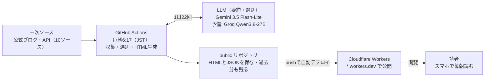

# おはようAI 要件定義 v2

作成 2026-10-08 ・ 更新 2026-10-09

## 概要と目的

毎朝7時（JST）までに、海外の一次ソースからAIニュースを重要度順に最大20本選び、初心者向けの日本語で配信する静的サイトを作る。目的はAILEAPの「AIでこんなこともできます」を体感してもらう見本で、運用費は0円、独自ドメインは使わずCloudflareの無料サブドメインで公開する。

- 対象読者: AIに詳しくない社会人・個人事業主。閲覧の8割以上がスマホと想定
- 見せたいこと: 「毎朝AIが自動で調べて、要約して、サイトまで作っている」こと自体
- 編集方針: 一次ソースへのリンクを必ず付け、本文の全訳はしない（要約＋リンク）
- サイト名: おはようAI（フォルダー・リポジトリ・Worker名は `ohayo-ai`）
- マスコット: ニュー助

## システム構成



読者が見るのは事前に生成した静的ページだけなので、表示が速く、サーバー費用もかからない。

- リポジトリ: public。Actionsの標準ランナーが無料・無制限になる。APIキーはSecretsに置くので公開されない
- 実行: cron `17 21 * * *`（JST 6:17）と手動実行（workflow_dispatch）
- 配信: Cloudflare Workers（静的アセット）。Workers Builds でリポジトリと連携し、pushのたびに `public/` を自動デプロイして `ohayo-ai.<アカウント名>.workers.dev` で公開する。プログラムは置かず、静的ファイルの配信だけに使う

## 情報ソース一覧

巡回先は10ソース。v1の5ソースのうちRedditとarXivを外し、一般の人が触れる発表が多いGoogle系2つと、「明日から使えるツール」を拾うProduct Hunt、コミュニティ枠のHacker Newsなどを足した。確認日は2026-10-08。

| ソース | 枠 | 取得方式 | 採用の目安 | 確認状況 |
| --- | --- | --- | --- | --- |
| [OpenAI News](https://openai.com/news/) | 公式 | RSS `openai.com/news/rss.xml` | 全件を候補に | 第三者のフィード一覧で確認 |
| [Google AI（The Keyword）](https://blog.google/innovation-and-ai/technology/ai/) | 公式・追加 | RSS `blog.google/innovation-and-ai/technology/ai/rss/` | 全件を候補に | 取得確認済み |
| [Google DeepMind](https://deepmind.google/blog/) | 公式・追加 | RSS `deepmind.google/blog/rss.xml` | 全件を候補に | 取得確認済み |
| [Anthropic News](https://www.anthropic.com/news) | 公式 | 一覧ページのHTML解析（公式RSSなし） | 全件を候補に | RSSがないことを確認 |
| [Hugging Face Blog](https://huggingface.co/blog) | 公式 | RSS `huggingface.co/blog/feed.xml` | 全件を候補に | 第三者のフィード一覧で確認 |
| [HF Daily Papers](https://huggingface.co/papers) | 研究・論文 | JSON API `huggingface.co/api/daily_papers?date=YYYY-MM-DD` | upvote上位3本 | 取得確認済み |
| [HF トレンドモデル](https://huggingface.co/models) | 新モデル・追加 | JSON API `huggingface.co/api/models?sort=trendingScore` | 上位5本 | 取得確認済み |
| [Product Hunt（AIカテゴリ）](https://www.producthunt.com/) | 便利なツール・追加 | Atom `producthunt.com/feed?category=artificial-intelligence` | 48時間以内の新着から | 取得確認済み |
| [Hacker News](https://news.ycombinator.com/) | コミュニティ・追加 | Algolia API（AI関連語＋ポイント順） | 上位5本 | 実装時に確認 |
| [Simon Willison's Weblog](https://simonwillison.net/) | 実践解説・追加 | Atom `simonwillison.net/atom/everything/` | 検知用。カードのリンク先は一次ソース | 取得確認済み |

追加した理由:

- Google AI / DeepMind: Gemini、画像生成、動画生成など一般向けの発表が多く、「画像・動画」カテゴリの主力になる
- Product Hunt: 非エンジニアが明日から試せるツールが毎日出る。AILEAPの「こんなこともできる」と最も相性が良い
- Hacker News: Redditの代わりのコミュニティ枠。ポイント数がそのまま重要度のシグナルになる
- Simon Willison: RSSのない発表（Anthropicなど）も当日中に取り上げるため、取りこぼしの保険になる

実装上の注意:

- Product Huntのフィードには過去の投稿も混ざるため、公開日で48時間以内に絞る
- Daily Papersは日付を指定しないと古い日付が返るため、必ず `date` を付ける

外したソース:

- Reddit（r/LocalLLaMA）: RSSは2026-11-13で終了し、新規の公開API申請も10月末で止まる。GitHub Actionsのランナーから403で拒否される報告もある
- arXiv（cs.CL / cs.AI）: 1日数百本あり初心者向けに不向き。HF Daily Papersで代替する

第2段階の候補（フィードの有無を実装時に確認）: Meta AI、Microsoft AI、Mistral、Qwen、xAI、主要OSSのGitHub Releases（Ollama、ComfyUIなど）

## 記事選定パイプライン

LLMの呼び出しは1日22回に抑える。候補の全件を要約せず、タイトルだけで一括ランク付けしてから上位20本だけを要約する。件数はすべて目安。

1. 収集: 全ソースから過去36時間分を取得する（目安80〜150件）
2. 重複除去: URLを正規化して `data/seen.json`（過去7日分）と照合し、タイトルの類似度で同じ話題を1件に束ねる
3. ルールで一次絞り込み: ソース別の重み、HNのポイント、公開日時で約60件にする
4. 一括ランク付け（LLM 1回）: 60件のタイトルと冒頭200字をまとめて渡し、影響度1〜5とカテゴリを返させる
5. 上位20本を決定: 影響度2以下は載せない。ニュースが少ない日は20本未満でよい
6. 本文取得: trafilaturaで本文を抽出し、先頭6,000字に制限する。取れない場合はRSSの要約で代替し、カードに「概要のみ」と表示する
7. 記事ごとの要約（LLM 20回）: 日本語タイトル、3行要約、用語メモ、カテゴリ、影響度
8. 今日のまとめ（LLM 1回）: 今日の3行まとめ、AI天気、ニュー助のひとこと
9. 生成と公開: Jinja2で index・アーカイブ・用語集・裏側ページのHTMLを作り、差分があるときだけコミットしてpushする

## LLM構成

メインはGemini 3.5 Flash-Lite、GroqのQwen3.8-27Bはフォールバック兼比較用にする。v1の `gemini-2.5-flash` は、新規プロジェクトには3.5 Flash-Liteか3.8 Flashを使うよう案内されており、2.5系の利用も過去の利用者に限定されているため変更する。

| 項目 | Gemini 3.5 Flash-Lite | Groq Qwen3.8-27B |
| --- | --- | --- |
| 役割 | メイン | フォールバック・品質比較 |
| 提供状態 | GA | Preview（評価用途、短い予告で終了の可能性） |
| 無料枠 | プロジェクト単位。上限はAI Studioで確認 | 30 RPM / 1K RPD / 8K TPM / 200K TPD |
| 構造化出力 | JSON Schema | `strict: true` 対応 |
| 注意点 | 無料枠の入力は製品改善に使われ得る | 8K TPMのため1分2本程度に間引く。思考モードはオフ |

呼び出し回数は1日22回（ランク付け1＋要約20＋まとめ1）。Groqで全部処理した場合も約80Kトークンで、1日の上限200Kに収まる。

実装方針:

- 両社ともOpenAI互換APIで呼べるので、環境変数 `LLM_PROVIDER` で切り替える薄い抽象層を作る
- 失敗時は1回再試行し、それでも失敗したらもう一方のプロバイダーに切り替える
- 最初の1週間は同じ記事を両方に投げて出力を並べ、日本語の質で最終決定する

出力の検証（Pydanticでスキーマ検証したうえで追加チェック）:

- 簡体字の混入チェック（Qwen系で起きやすい）
- 要約に出てくる数字が本文にもあるかを照合し、ないものは要約から外す
- 各フィールドの文字数上限（3行要約は1行60字以内など）

要約1本あたりの出力例:

```json
{
  "title_ja": "Googleが動画も読める軽量AIを無料公開",
  "what": "Googleが、文章と画像と動画をまとめて扱える小型AIを公開した",
  "new": "スマホやノートPCでも動くほど軽く、誰でも無料で使える",
  "impact": "写真や動画の整理・検索アプリが、ネットなしでも賢くなる",
  "term": {"word": "マルチモーダル", "note": "文章・画像・音声など複数の種類の情報を一緒に扱えること"},
  "category": "新モデル",
  "score": 4
}
```

カテゴリは「注目トピック」「画像・動画」「便利なツール」「新モデル」「研究・論文」の5種で固定する。

## UI/UX・キャラクター

オリジナルのマスコット「ニュー助」が毎朝ニュースを案内する。白ベース＋ミントグリーンの配色、本文16px以上・行間1.8、スマホファーストのカード一覧は v1 のまま引き継ぐ。デザインの実物は `docs/design/` を参照。

マスコット「ニュー助」:

- 名前の由来: 「ニュース」＋昔ながらの「〜助」。毎朝ニュースを届けてくれる相棒
- 見た目: ミント色の丸いロボット。頭にアンテナ、胸に小さな画面。SVG1枚で描き、CSSで動かす
- 役割: AI天気の発表、今日のひとこと（LLMが生成）、用語メモの解説役、読了時のお祝い
- 表情は4種（ふつう・びっくり・にっこり・考え中）。目と口のパーツだけ差し替える

画面の上から順に:

1. ヘッダー: サイト名と「今朝6:30更新」
2. 今日のAI天気: その日の影響度の合計から、晴れ（おだやか）・くもり（動きあり）・かみなり（大ニュースの日）を出す。ニュー助が天気に合わせて反応する
3. ニュー助のひとこと: 吹き出しで今日の3行まとめを読み上げる
4. カテゴリタブ: すべて・注目・画像/動画・ツール・新モデル・研究
5. ニュースカード（最大20枚）: カテゴリバッジ、重要度ラベル、日本語タイトル、3行要約、用語メモ、一次ソース（英語）へのリンク
6. 読了エリア: 最後のカードまで読むとニュー助が拍手し、連続で読んだ日数を出す

重要度は数字や★ではなくラベルで出す: スコア5は「今日いちばん」、4は「要チェック」、3は「知っておくと得」。

| 演出 | きっかけ | 動き | 長さ |
| --- | --- | --- | --- |
| ニュー助の登場 | ページ表示 | 下からぴょこっと出て手を振る | 0.6秒 |
| 天気への反応 | 天気の決定 | 晴れは左右にゆらゆら、かみなりは跳ねて目が丸くなる | 1秒、ループなし |
| ひとことの吹き出し | 登場の後 | 1文字ずつではなく1行ずつフェードイン | 1行0.3秒 |
| カードの出現 | スクロール | 下から順にふわっと（IntersectionObserver） | 0.35秒 |
| 今日いちばん | 初回表示 | カードの縁を光が1周する | 1回だけ |
| タブ切り替え | タップ | カードが滑らかに並び替わる（View Transitions API） | 0.3秒 |
| 用語メモ | タップ | 下からボトムシートが出て、ニュー助が説明する | 0.25秒 |
| 読了 | 最後のカードが見えた時 | ニュー助が拍手、紙吹雪少し | 1.2秒 |

守るルール:

- 読む部分（タイトルと要約）は動かさない。動くのはニュー助と装飾だけ
- ずっと動き続けるのはニュー助のまばたきだけ
- OSで「視差効果を減らす」が有効なら、フェード以外のアニメーションを止める
- ライブラリは使わずCSSとWeb Animations APIで作り、初回表示1秒以内を守る
- 用語メモはツールチップではなくボトムシートに統一する（スマホで押しやすいため）

## AILEAPへの導線

このサイトそのものを「AI自動化の実例」として見せ、問い合わせにつなげる。売り込みはページ下部と裏側ページに限り、ニュースを読む邪魔はしない。

- フッターの一文: 「このサイトは、AIが毎朝自動で調べて、まとめて、作っています」＋「仕組みを見る」ボタン
- 裏側ページ（/behind/）: 収集から公開までの流れをアニメーション図で見せる。毎朝の実績も出す（例: 「今朝は112件から20本を選びました」「処理時間 9分」）
- 裏側ページの最後に問い合わせ: 「あなたの業務も、こんなふうに自動化できます」→ AILEAPの問い合わせ先
- シェア用の画像（OGP）を毎朝自動生成: AI天気とニュー助、今日いちばんの記事タイトル。XやLINEで共有されたときの見栄えを良くする
- 計測: Cloudflare Web Analytics（Cookieを使わない無料の解析）で閲覧数と訪問者数を見る。ボタンのクリック数は取れないため、裏側ページ（/behind/）の閲覧数で「仕組みを見る」への反応を測る

## 非機能要件

すべて無料枠の範囲で動かし、どの上限にも余裕を持たせる。リポジトリはpublicにする（標準ランナーのActionsが無料・無制限になるため）。

| サービス | 無料枠 | このサイトの使用量（見込み） |
| --- | --- | --- |
| GitHub Actions（public リポジトリ） | 標準ランナーは無料、分数の上限なし | 1日1回、10〜15分 |
| Cloudflare Workers（静的アセット） | 静的ファイルの配信は無料・無制限。プログラム実行は1日10万リクエストまで | 静的配信のみ（プログラム実行なし） |
| Workers Builds（自動デプロイ） | 月3,000分、同時1件、1回20分まで | 1日1回、1〜2分 |
| Gemini API | 無料枠あり（上限はAI Studioで確認） | 1日22回 |
| Groq（予備） | 30 RPM / 1K RPD / 8K TPM / 200K TPD | 予備に回ったときだけ、約80Kトークン/日 |
| Cloudflare Web Analytics | 無料 | 閲覧数・訪問者数の計測（JSスニペットを埋め込む） |

- 表示速度: スマホ（4G想定）で初回表示1秒以内。HTMLは事前生成、画像はマスコットのSVGとOGPだけ
- 転送量: 初回200KB以下を目安。本文はOS標準のゴシック体、見出しとニュー助のセリフだけ丸ゴシック（M PLUS Rounded 1c、Google Fonts）
- アクセシビリティ: 文字と背景のコントラスト比4.5以上、タップ領域44px以上、視差効果を減らす設定に対応
- 公開URL: `ohayo-ai.<アカウント名>.workers.dev`（独自ドメインなし）

## ディレクトリ構成

Pythonはuvで管理し、生成物は `public/` にだけ出す。Cloudflare Workers は `wrangler.jsonc` の設定に従って `public/` をそのまま配信する（ビルドコマンドなし）。

```
ohayo-ai/                      # ローカルは C:\Dev\ohayo-ai
├── .github/workflows/
│   └── update-news.yml        # 毎朝 21:17 UTC（JST 6:17）＋手動実行
├── src/ai_news/
│   ├── sources/               # ソースごとの取得（rss / anthropic / hf / hn / producthunt）
│   ├── select.py              # 重複除去・一次絞り込み・ランク付け
│   ├── llm.py                 # Gemini / Groq の切り替え
│   ├── summarize.py           # 記事要約と今日のまとめ
│   ├── validate.py            # 簡体字・数字照合・文字数チェック
│   └── render.py              # Jinja2 で HTML と OGP 画像を生成
├── templates/                 # index / archive / glossary / behind / 404
├── data/
│   ├── seen.json              # 過去7日分の取得済みURL
│   ├── source_health.json     # ソースごとの取得件数（2日続けて0件なら失敗にする）
│   ├── glossary.json          # 用語メモの蓄積
│   └── daily/2026-10-08.json  # 日ごとの結果（アーカイブの元）
├── public/                    # 公開ルート（すべて生成物）
│   ├── index.html
│   ├── 404.html
│   ├── archive/
│   ├── glossary/
│   ├── behind/
│   ├── assets/                # style.css / app.js / nyusuke.svg
│   └── news.json
├── docs/                      # 要件定義とデザイン資料
├── wrangler.jsonc             # Cloudflare Workers の設定（public/ を配信）
├── pyproject.toml
├── uv.lock
├── CLAUDE.md
└── README.md
```

Workers の設定はこれだけで、プログラムは置かない。

```json
{
  "name": "ohayo-ai",
  "compatibility_date": "2026-10-01",
  "assets": {
    "directory": "./public",
    "not_found_handling": "404-page"
  }
}
```

Cloudflareの画面でGitHubリポジトリを接続し、ビルドコマンドは空、デプロイコマンドは `npx wrangler deploy` にする。Workers Builds が動かない場合は、Actions から `wrangler deploy` を直接実行する方式に切り替えられる（APIトークンをSecretsに置く）。

## 運用・監視・リスク

止まったことに気づける仕組みを最初から入れる。通知はGitHubの失敗メールだけで足りる（無料）。

| リスク | 対策 |
| --- | --- |
| 定期実行が止まる（publicリポジトリは60日間活動がないと停止） | 毎日コミットが出るので通常は問題ない。取得失敗が続いてもログを `data/` にコミットし、活動を切らさない |
| 実行の遅れ（毎時0分は混雑しやすい） | 21:17 UTC に設定して7時に間に合わせる。`workflow_dispatch` で手動実行もできるようにする |
| サイト構造の変更で取得が0件になる（特にAnthropicのHTML解析） | 同じソースが2日続けて0件ならActionsを失敗扱いにして通知 |
| 要約の誤り・盛りすぎ | 数字の照合チェック。カードに「AIによる要約です」と小さく表示し、一次ソースへ誘導 |
| 著作権 | 本文の全訳はしない。要約は自分の言葉で短く、一次ソースへのリンクを必ず付ける。元記事の画像は使わない |
| Groq Preview の提供終了 | メインはGeminiなので影響は小さい。終了したら比較用から外す |
| APIキーの漏えい | キーはリポジトリのSecretsに置く（publicでも公開されない）。forkからのプルリクエストではワークフローを動かさない |

## v1からの主な変更点と未決事項

| 項目 | v1 | v2 | 理由 |
| --- | --- | --- | --- |
| LLM | gemini-2.5-flash | Gemini 3.5 Flash-Lite＋Groq予備 | 2.5系は新規プロジェクトでの利用が制限されている |
| Reddit | 巡回する | 外す | RSS終了・公開API終了、Actionsから403 |
| arXiv | 巡回する | 外す（HF Daily Papersで代替） | 量が多すぎて初心者向けでない |
| 掲載本数 | 未定 | 重要度順に最大20本 | 方針の決定 |
| 描画方式 | ブラウザでnews.jsonを描画 | PythonでHTMLを事前生成 | 検索とSNSのプレビューに中身を出すため |
| 状態の保存 | なし | seen / glossary / daily をコミット | Actionsは毎回まっさらな環境で動く |
| リポジトリ | 未定 | public | Actionsが無料・無制限になる |
| 依存管理 | requirements.txt | pyproject.toml＋uv.lock | uvでの管理に合わせる |
| CSS | Tailwind CDN | 自前のCSS | Play CDNは本番向けではない |
| 演出 | 控えめ | マスコット中心のキャラクター的な演出 | 方針の決定 |
| カテゴリ | 2.2とUIで名前が不一致 | 5種に統一 | 不整合の解消 |
| 公開先 | Cloudflare Pages | Cloudflare Workers（静的アセット） | Cloudflareが新規プロジェクトに推奨する主力。今後のNext.js案件にもそのまま使える |

未決事項:

- [x] サイト名 → おはようAI に決定（フォルダー・リポジトリ・Worker名は ohayo-ai）
- [x] マスコットの名前 → ニュー助に決定
- [ ] AILEAPの問い合わせ先URL
- [x] 公開先: Workers（静的アセット）に決定
- [x] 成果の目標値 → 当面は数値目標を置かず、閲覧数と /behind/ の閲覧数の推移だけを見る

## 出典

- [Gemini deprecations（Google AI for Developers）](https://ai.google.dev/gemini-api/docs/deprecations)
- [Gemini API Rate limits](https://ai.google.dev/gemini-api/docs/rate-limits)
- [Groq Rate Limits](https://console.groq.com/docs/rate-limits)
- [Groq Supported Models](https://console.groq.com/docs/models)
- [Groq Structured Outputs](https://console.groq.com/docs/structured-outputs)
- [Reddit to shut RSS feeds Nov. 13（AI Weekly）](https://aiweekly.co/alerts/reddit-to-shut-rss-feeds-nov-13-close-public-api-by-march-2027)
- [Reddit's API Returns 403 From GitHub Actions（redditapis.com）](https://www.redditapis.com/blogs/reddit-api-blocked-github-actions-2026)
- [Anthropic News RSS feed（Feeder）](https://feeder.co/discover/df052969a2/anthropic-com-news)
- [About billing for GitHub Actions（GitHub Docs）](https://docs.github.com/en/billing/managing-billing-for-github-actions/about-billing-for-github-actions)
- [scheduled-workflow-activity-action（60日停止の説明）](https://github.com/WaterLemons2k/scheduled-workflow-activity-action)
- [Cloudflare Pages（新規はWorkers推奨の記載）](https://developers.cloudflare.com/pages/)
- [Workers static assets](https://developers.cloudflare.com/workers/static-assets/)
- [Static assets の料金と制限](https://developers.cloudflare.com/workers/static-assets/billing-and-limitations/)
- [Workers の制限（無料プラン）](https://developers.cloudflare.com/workers/platform/limits/)
- [Workers Builds の制限と料金](https://developers.cloudflare.com/workers/ci-cd/builds/limits-and-pricing/)
- [Cloudflare Web Analytics](https://developers.cloudflare.com/web-analytics/about/)
- [Best AI news RSS feeds 2026（Readless）](https://www.readless.app/de/blog/best-ai-news-rss-feeds-2026)
